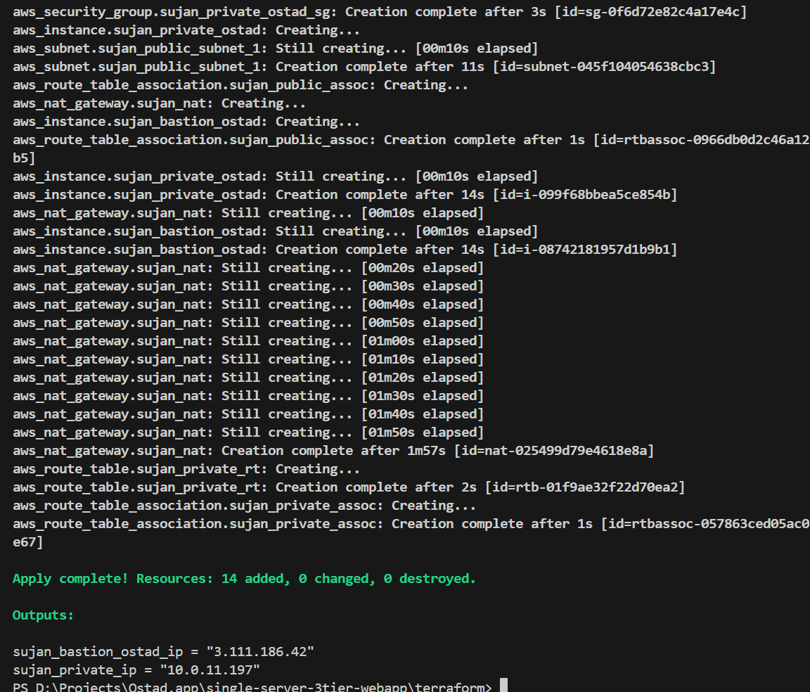
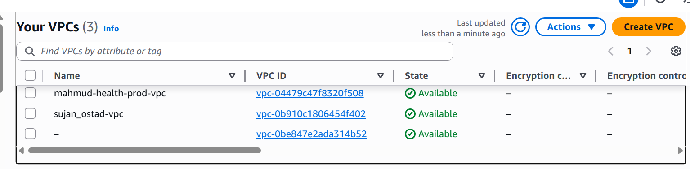
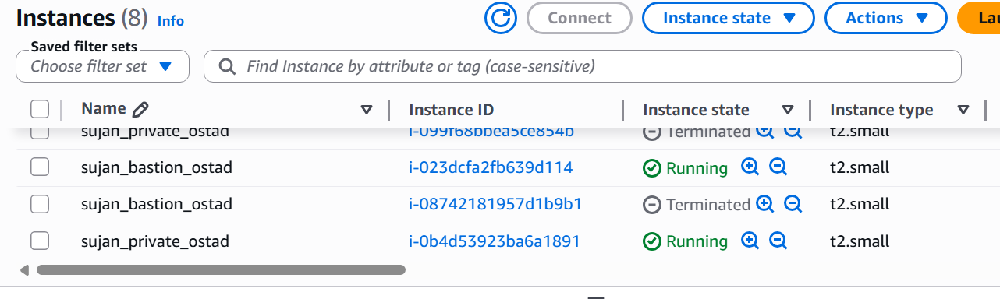
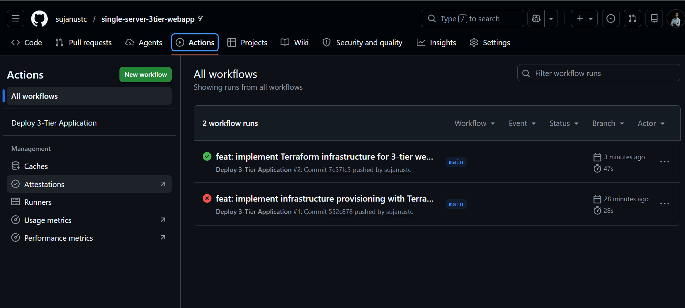
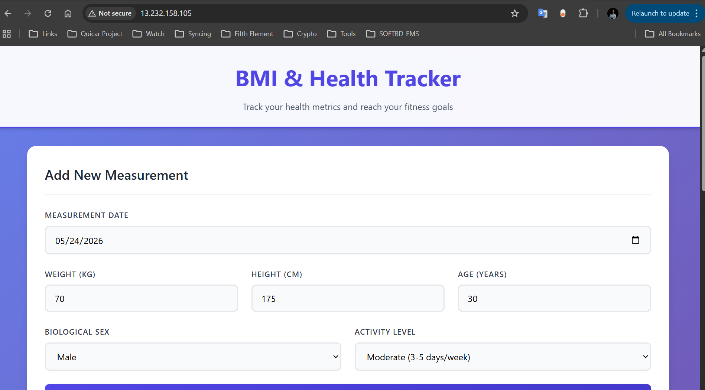

# Project Submission: Automated 3-Tier Web Application Infrastructure Provisioning & CI/CD Pipeline

This repository contains the complete implementation for the automated deployment of the **BMI & Health Tracker** 3-tier web application. The deployment leverages **Infrastructure as Code (IaC)** with **Terraform** for AWS resource provisioning, and **GitHub Actions** for the automated CI/CD build and release pipeline.

---

## 📋 Table of Contents
- [Assignment Objective](#-assignment-objective)
- [Project Architecture](#-project-architecture)
- [Key Deliverables & File Locations](#-key-deliverables--file-locations)
- [Infrastructure Components](#-infrastructure-components)
- [Proof of Completion (Screenshots)](#-proof-of-completion-screenshots)
- [How to Deploy & Recreate the Project](#-how-to-deploy--recreate-the-project)

---

## 🎯 Assignment Objective
Previously, the 3-tier application architecture was deployed manually using the AWS Management Console (UI). 
The goal of this assignment is to recreate the entire infrastructure programmatically using **Terraform** following IaC best practices, and set up a **GitHub Actions CI/CD Pipeline** to automate testing, building, and code deployment directly onto the target servers.

---

## 🏛️ Project Architecture
The application runs on a secure, multi-tier layout within a custom AWS Virtual Private Cloud (VPC):

```
                     ┌──────────────────────────────┐
                     │         INTERNET             │
                     └──────────────┬───────────────┘
                                    │ HTTP/HTTPS (Port 80/443)
                                    ▼
┌─────────────────────────────────────────────────────────────────────────┐
│                           AWS CUSTOM VPC                                │
│                                                                         │
│  ┌───────────────────────────────────────────────────────────────────┐  │
│  │   PUBLIC SUBNET (10.0.1.0/24)                                     │  │
│  │                                                                   │  │
│  │   ┌───────────────────────────────────────────────────────────┐   │  │
│  │   │  Frontend Instance (sujan_bastion_ostad)                  │   │  │
│  │   │  - Serves static React SPA via Nginx                      │   │  │
│  │   │  - Acts as SSH Bastion Host                               │   │  │
│  │   │  - Reverse-proxies /api/* requests to the private subnet  │   │  │
│  │   └───────────────────────────────────────────────────────────┘   │  │
│  └────────────────────────────────┬──────────────────────────────────┘  │
│                                   │ Port 3000                           │
│                                   ▼                                     │
│  ┌───────────────────────────────────────────────────────────────────┐  │
│  │   PRIVATE SUBNET (10.0.11.0/24)                                   │  │
│  │                                                                   │  │
│  │   ┌───────────────────────────────────────────────────────────┐   │  │
│  │   │  Private Instance (sujan_private_ostad)                   │   │  │
│  │   │  - Runs Express.js API under PM2 Process Manager          │   │  │
│  │   │  - PostgreSQL Database (port 5432) for measurements       │   │  │
│  │   └───────────────────────────────────────────────────────────┘   │  │
│  └───────────────────────────────────────────────────────────────────┘  │
└─────────────────────────────────────────────────────────────────────────┘
```

1.  **Frontend / Bastion Host (Public Subnet):** Hosts Nginx serving compiled React static assets. It accepts public web requests and routes API calls (`/api/*`) internally to the private server. It also functions as a secure entry point (Bastion) for SSH management.
2.  **Application / Database Server (Private Subnet):** Hosts the Express Node.js backend and a PostgreSQL database. It has no direct public access and can only be reached from the public subnet or by SSH ProxyJumping through the Bastion.

---

## 📁 Key Deliverables & File Locations

All submission files are organized in the following locations within this repository:

| Component | Path | Description |
| :--- | :--- | :--- |
| **Terraform Code** | [terraform/](file:///d:/Projects/Ostad.app/single-server-3tier-webapp/terraform) | Main configuration, variables, outputs, and provider definitions. |
| **Terraform Main HCL** | [terraform/main.tf](file:///d:/Projects/Ostad.app/single-server-3tier-webapp/terraform/main.tf) | Provisions VPC, subnets, route tables, security groups, gateways, and EC2 instances. |
| **Terraform Variables** | [terraform/variables.tf](file:///d:/Projects/Ostad.app/single-server-3tier-webapp/terraform/variables.tf) | Declares project parameters (AWS region, database credentials, key pairs, etc.). |
| **Terraform Secrets Template** | [terraform/terraform.tfvars](file:///d:/Projects/Ostad.app/single-server-3tier-webapp/terraform/terraform.tfvars) | Variable configuration values (ignored by git). |
| **CI/CD Workflow** | [.github/workflows/deploy.yml](file:///d:/Projects/Ostad.app/single-server-3tier-webapp/.github/workflows/deploy.yml) | GitHub Actions workflow to build the React application and deploy components to public/private instances. |
| **Instance Bootstrap Scripts** | [terraform/scripts/](file:///d:/Projects/Ostad.app/single-server-3tier-webapp/terraform/scripts) | Shell scripts to install Node.js, PostgreSQL, Nginx, PM2, and run database migrations automatically on boot. |

---

## ⚙️ Infrastructure Components
*   **VPC:** Custom VPC (`10.0.0.0/16`) for isolation.
*   **Subnets:** `sujan_public_subnet_1` (public facing, `10.0.1.0/24`) and `sujan_private_subnet_1` (secure internal, `10.0.11.0/24`).
*   **Gateways:** Internet Gateway (`sujan_igw`) for public internet access, and NAT Gateway (`sujan_nat`) allowing private instances to pull security updates/dependencies outbound.
*   **Security Groups:** 
    *   `sujan_bastion_ostad_sg`: Allows ports 22 (SSH), 80 (HTTP), and 443 (HTTPS) inbound from anywhere.
    *   `sujan_private_ostad_sg`: Restricts incoming traffic, allowing SSH (22) and API (3000) **only** from the public Frontend security group.
*   **Auto-Bootstrapping:** Utilizing EC2 User Data, database and web servers are fully operational upon launch without manual script execution.

---

## 📸 Proof of Completion (Screenshots)

Below are the verification screenshots capturing the successful provisioning of infrastructure, operational code execution in AWS, CI/CD pipeline automation, and the running application.

### 1. Terraform Apply Output
The successful execution of `terraform apply` on the local machine, creating 14 AWS resources:


### 2. AWS VPC Dashboard
Confirmation of the created custom VPC (`sujan_ostad-vpc`) inside the AWS Management Console:


### 3. AWS EC2 Instances
The newly created `sujan_bastion_ostad` (public subnet) and `sujan_private_ostad` (private subnet) running in `us-east-1`:


### 4. CI/CD GitHub Actions Pipeline
Proof of successful build, SSH ProxyJump authentication, static file deployment, and PM2 backend reloading:


### 5. Running Application in Browser
The BMI Tracker interface loading successfully via the Frontend EC2 Public IP and communicating with the Database:


---

## 🚀 How to Deploy & Recreate the Project

Follow these steps to deploy the infrastructure and run the application.

### Phase A: Infrastructure Provisioning
1.  Navigate to the `terraform/` directory:
    ```bash
    cd terraform
    ```
2.  Provide your AWS credentials to your local shell:
    ```powershell
    $env:AWS_ACCESS_KEY_ID="YOUR_AWS_ACCESS_KEY_ID"
    $env:AWS_SECRET_ACCESS_KEY="YOUR_AWS_SECRET_ACCESS_KEY"
    ```
3.  Fill in your deployment variables inside `terraform.tfvars`:
    *   `key_pair_name` (Existing SSH key pair name on AWS)
    *   `db_password` (Password for your database user)
    *   `aws_access_key` (Same as above, for Terraform validation fallback)
    *   `aws_secret_key` (Same as above)
4.  Run Terraform commands to build the infrastructure:
    ```bash
    terraform init
    terraform apply -auto-approve
    ```
5.  Retrieve the outputs (`sujan_bastion_ostad_ip` and `sujan_private_ip`).

### Phase B: CI/CD Secret Configuration
To enable automated deployments:
1.  Navigate to your repository settings on GitHub.
2.  Go to **Settings > Secrets and variables > Actions**.
3.  Add the following Repository Secrets:
    *   `SSH_PRIVATE_KEY`: Copy the full text content of your AWS SSH private `.pem` key file.
    *   `FRONTEND_HOST`: The public IP of the frontend (`sujan_bastion_ostad_ip`).
    *   `BACKEND_HOST`: The private IP of the backend (`sujan_private_ip`).

### Phase C: Run Deployments
Any subsequent push to the `main` branch will build and deploy the React application and Express API onto AWS automatically:
```bash
git add .
git commit -m "deploy: update backend and frontend"
git push origin main
```
